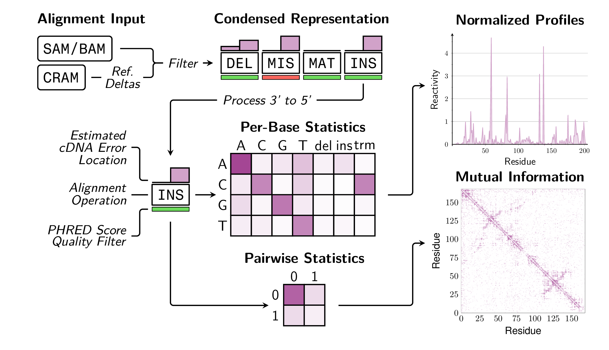

## Overview

`cmuts` is a suite of programs for counting mutations and computing reactivity profiles from data generated via chemical probing experiments. It features
* Fast, compiled C++ code with native multithreading support
* Streamed IO and direct output to compressed HDF5 files
* Mutation-informed handlding of ambiguous deletions

In a picture:



Detailed documentation can be found at [hmblair.github.io/cmuts](https://hmblair.github.io/cmuts).

## Quick Start

### Installation

```bash
# Clone the repository
git clone https://github.com/hmblair/cmuts.git
cd cmuts

# Install system dependencies (Ubuntu/Debian)
sudo apt-get install libhdf5-dev libhts-dev zlib1g-dev cmake

# Build and install
./configure && pip install -e ".[dev]"
```

For macOS with Homebrew:
```bash
brew install hdf5 htslib zlib cmake
./configure && pip install -e ".[dev]"
```

### Basic Usage

```bash
# Count mutations from aligned BAM files
cmuts-core -b aligned.bam -f reference.fasta -o counts.h5

# Normalize counts to reactivity profiles
cmuts-normalize counts.h5 reference.fasta -o reactivity.h5

# Visualize results
cmuts-plot reactivity.h5 --output figure.png
```

### Python API

```python
import cmuts
import h5py

# Load reactivity data
with h5py.File("reactivity.h5", "r") as f:
    data = cmuts.ProbingData.load("combined", f)

# Access reactivity values
print(f"Mean reactivity: {data.reactivity.mean():.3f}")
print(f"Signal-to-noise: {data.snr.mean():.2f}")
```

## Features

- **High Performance**: C++ core with OpenMP parallelization processes millions of reads efficiently
- **MPI Support**: Distribute workloads across compute nodes for large-scale analyses
- **Streaming I/O**: Process BAM/CRAM files without loading entire datasets into memory
- **Flexible Normalization**: Multiple normalization schemes (raw, percentile, outlier-based)
- **Pairwise Analysis**: Compute mutation correlations and mutual information matrices

## Project Structure

```
cmuts/
├── src/cpp/          # C++ core (mutation counting, BAM/CRAM parsing)
├── src/python/cmuts/ # Python package (normalization, visualization)
├── tests/            # Test suites
└── docs/             # Documentation
```

See [docs/architecture.md](docs/architecture.md) for detailed architecture documentation.

## Development

```bash
# Install development dependencies
pip install -e ".[dev]"

# Run tests
pytest tests/python -v

# Run linting
ruff check src/python/cmuts
mypy src/python/cmuts

# Install pre-commit hooks
pre-commit install
```

## License

MIT License - see [LICENSE](LICENSE) for details.

## Citation

If you use cmuts in your research, please cite:
```
Blair, H.M. (2024). cmuts: Chemical mutation profiling for RNA structure analysis.
```
