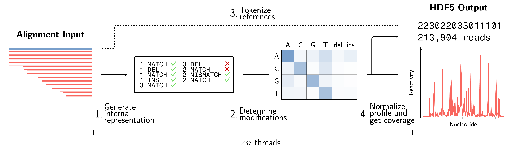

# cmuts

Fast mutation counting and reactivity profiling for MaP-seq experiments.



## Overview

`cmuts` is a high-performance program designed for analyzing MaP-seq (Mutational Profiling via sequencing) experiments. It provides comprehensive tools for counting mutations and computing reactivity profiles with exceptional speed and accuracy.

### Key Features

- :material-flash: **Fast, compiled C++ code** with native multithreading support
- :material-harddisk: **Streamed IO** and direct output to compressed HDF5 files  
- :material-dna: **Advanced deletion handling** including arbitrary-length ambiguous deletions with mutation-informed spreading
- :material-cog: **Four independent processing steps** for complete analysis workflow

### Workflow Components

cmuts performs analysis through four main components:

1. **Modification Counting** - Identify and count mutations in aligned sequencing reads
2. **Normalization** - Compute normalized reactivity profiles using `cmuts-normalize`
3. **Tokenization** - Convert reference sequences to numerical tokens (optional)
4. **Joint Analysis** - Analyze co-occurring modifications across positions (optional)

## Quick Start

Get up and running with cmuts in just a few commands:

```bash
# Basic mutation counting
cmuts -o output.h5 -f reference.fasta aligned_reads.bam

# Recommended for standard MaP-seq analysis
cmuts -o output.h5 -f reference.fasta aligned_reads.bam \
    --no-insertions \
    --filter-coverage

# Parallel processing with MPI
mpirun -np 8 cmuts -o output.h5 -f reference.fasta aligned_reads.bam
```

## What You Need

To get started with cmuts, you'll need:

- **Reference sequences** in FASTA format
- **Aligned reads** in SAM/BAM/CRAM format
- **Index files** (`.bai` or `.crai`) - created automatically if missing

!!! tip "File Preparation"
    If your alignment file isn't sorted, cmuts will automatically call `samtools sort` to prepare it for analysis.

## Output Format

cmuts generates HDF5 files containing mutation count data with dimensions `n × l × 4 × 7`, where:

- `n` = number of reference sequences
- `l` = maximum sequence length
- `4` = original base types (A, C, G, T)
- `7` = mutation types (A, C, G, T substitutions + insertions + deletions + matches)

## Next Steps

- **[Installation Requirements](installation/requirements.md)** - System requirements and dependencies
- **Basic Installation** - Step-by-step installation guide
- **Usage Examples** - Detailed usage scenarios and examples

## Support

- :material-github: **Issues**: [Report bugs or request features](https://github.com/hmblair/cmuts/issues)
- :material-file-document: **Documentation**: Complete guides and API reference
- :material-email: **Contact**: Reach out for questions or collaboration

---

*cmuts is designed for researchers working with MaP-seq data who need fast, accurate mutation analysis with minimal computational overhead.*
