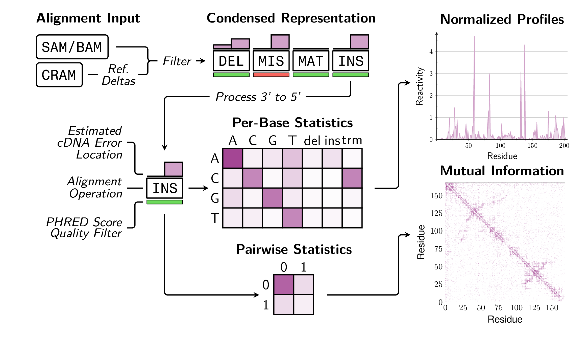

# cmuts

Fast mutation counting and reactivity profiling for MaP-seq experiments.

## Try it Online

You can run cmuts directly in your browser via the [Hugging Face Space](https://huggingface.co/spaces/hamishmilsonblair/cmuts) — no installation required.

## Getting Started

1. Install all [requirements](/cmuts/installation/requirements)
2. [Build and install](/cmuts/installation/installation) cmuts
3. Run the example under `./examples/map-seq`
4. Copy the `./COMMANDS` file and modify as necessary for your inputs
