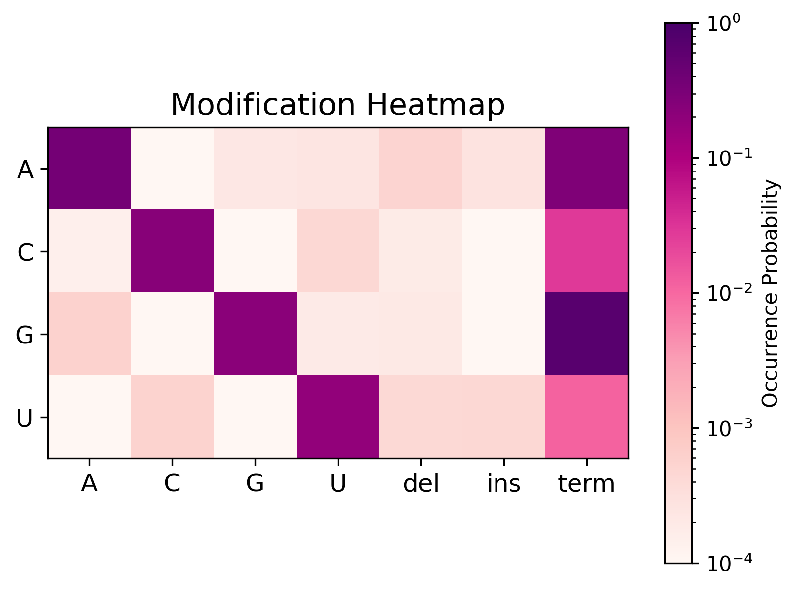

## Purpose

`cmuts core` performs the main job of the `cmuts` pipeline, which is determining the location and type of mutations, insertions, and deletions in a collection of aligned reads.

## Usage

All modes of `cmuts core` require two inputs to run:

1. **Reference sequences**, stored in a FASTA file,
2. **Aligned reads**, stored in one or more SAM/BAM/CRAM files

The basic syntax is
```bash
cmuts core \
  -f $FASTA \
  -o $OUTPUT \
  $FILES
```

It is recommended to use default settings alongside the `--no-insertions` flag when processing chemical probing data.

!!! warning
    The alignments must be sorted before passing to `cmuts`. If you are generating them via `cmuts align`, then they will automatically be sorted for you.

### Modification Counting

Most uses of `cmuts core` (without any of the flags specified later) will output an HDF5 file with a dataset of shape \(n \times l \times 4 \times 7\). The former two dimensions specify the reference sequence and residue respectively, and the latter two specify the type of modification seen in accordance with the following array:



The diagonal corresponds to matches, whereas the off-diagonal corresponds to mismatches. The final three columns correspond to deletions, insertions, and termination events respectively.

The name of the dataset is `counts-1d`, and the group to which it belongs corresponds to the name of the input file. For example, the command

```bash
cmuts core \
  -f $FASTA \
  -o $OUTPUT \
  IN1.bam SUBDIR/IN2.bam
```

will create an HDF5 file `$OUTPUT` with the structure

```
/
├── IN1
    └── counts-1d
└── SUBDIR
    └── IN2
        └── counts-1d
```

and both `IN1` and `IN2` are datasets as described above. 

### Pairwise Modification Counting

The `--pairwise` flag instructs `cmuts core` to count *pairs* of modifications alongside the one-dimensional data. In addition to the above output, the HDF5 file will contain a second dataset `counts-2d` of shape \(n \times l \times l \times 2 \times 2\). The first dimension specifies the reference sequence, the next two specifies each pair of bases in that sequence, and the final two specify the four entries of the joint Bernoulli distribution

\[
\begin{pmatrix}
p_{00} & p_{01} \\ p_{10} & p_{11}.
\end{pmatrix}
\]

Again for an example, the command

```bash
cmuts core \
  --pairwise \
  -f $FASTA \
  -o $OUTPUT \
  IN1.bam SUBDIR/IN2.bam
```

will create an HDF5 file `$OUTPUT` with the structure

```
/
├── IN1
    ├── counts-1d
    └── counts-2d
└── SUBDIR
    └── IN2
        ├── counts-1d
        └── counts-2d
```

## Command Line Options

### Core Options

**`-o, --output`** : Output HDF5 filename (required)

**`-f, --fasta`** : Reference FASTA file (required)

**`-t, --threads`** : The number of MPI processes to use (if built with MPI, default: 1)

**`--rebuild`** : Rebuild all index files (*.cmix and *.cmfa)

### Output Control

**`--overwrite`** : Overwrite existing HDF5 file

**`--compression`** : HDF5 compression level (0-9, default: 3)

### Analysis Modes

**`--tokenize`** : Tokenize reference sequences and store in `sequence` dataset

**`--pairwise`** : Compute pairwise modification counts

### Quality Filtering

**`--min-mapq`** : Mapping quality threshold (default: 10)

**`--min-phred`** : PHRED score threshold (default: 10)

**`--quality-window`** : Quality check window size around each base (default: 2)

**`--min-length`** : Minimum alignment length (default: 2)

**`--max-length`** : Maximum alignment length (default: 1,024)

**`--max-hamming`** : Skip reads with more than this many combined mismatches, insertions, and deletions (default: 1,024)

### Other Filtering

**`--ignore-bases`** : Do not count mismatches or deletions occuring at these bases. Pass as a single string (e.g. `--ignore-bases GU` for DMS experiments).

**`--no-reverse`** : Skip reverse-complemented reads

**`--only-reverse`** : Only use reverse-complemented reads

### Modification Detection

**`--max-indel-length`** : Maximum indel length to consider (default: 10)

**`--collapse`** : Collapse modifications within this distance in a read (default: 2)

**`--no-mismatches`** : Exclude mismatches from modification counts

**`--no-insertions`** : Exclude insertions from modification counts

**`--no-deletions`** : Exclude deletions from modification counts

### Deletion Handling

**`--deletion-gap`** : The number of gaps to allow when detecting ambiguous deletions (default: 0)

**`--uniform-spread`** : Uniformly spread ambiguous deletions

**`--no-spread`** : Do not spread ambiguous deletions

**`--disable-ambiguous`** : Use alignment-provided deletions only

**`--contiguous-ambiguous`** : Allow only contiguous regions as ambiguous deletions

### Sampling and Coverage

**`--no-match-filter`** : Do not filter matches based on their PHRED base score (as in `rf-count`)

**`--no-insertion-filter`** : Do not filter insertions based on their PHRED base score (as in `rf-count`)

**`--no-deletion-filter`** : Do not filter deletions based on their PHRED base score (as in `rf-count`)

### Performance

**`--chunk-size`** : Internal buffer size per thread in references (default: 128)

**`--print-every`** : Progress update frequency in seconds (default: 0.01)
